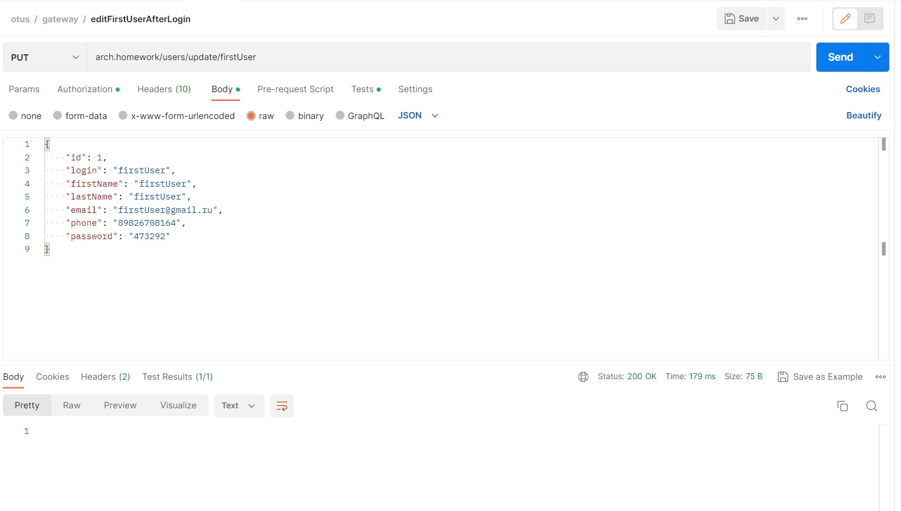
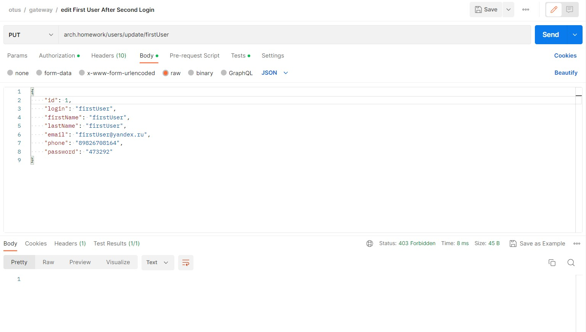

# Домашнее задание #5
## Backend for frontends. Apigateway

## Цель:
Добавлять в приложение аутентификацию и регистрацию пользователей.

Описание/Пошаговая инструкция выполнения домашнего задания:
Добавить в приложение аутентификацию и регистрацию пользователей.
Реализовать сценарий "Изменение и просмотр данных в профиле клиента".
Пользователь регистрируется. Заходит под собой и по определенному урлу получает данные о своем профиле. Может поменять данные в профиле. Данные профиля для чтения и редактирования не должны быть доступны другим клиентам (аутентифицированным или нет).
На выходе должны быть
0) описание архитектурного решения и схема взаимодействия сервисов (в виде картинки)

команда установки приложения (из helm-а или из манифестов). Обязательно указать в каком namespace нужно устанавливать.
1*) команда установки api-gateway, если он отличен от nginx-ingress.
тесты постмана, которые прогоняют сценарий:
регистрация пользователя 1
проверка, что изменение и получение профиля пользователя недоступно без логина
вход пользователя 1
изменение профиля пользователя 1
проверка, что профиль поменялся
выход* (если есть)
регистрация пользователя 2
вход пользователя 2
проверка, что пользователь2 не имеет доступа на чтение и редактирование профиля пользователя1.
В тестах обязательно
наличие {{baseUrl}} для урла
использование домена arch.homework в качестве initial значения {{baseUrl}}
использование сгенерированных случайно данных в сценарии
отображение данных запроса и данных ответа при запуске из командной строки с помощью postman.

## Установка
```
Деплоим posgres
templates\deployPostgre.sh
Ждем завершения деплоя postgres и деплоим бэкенд
templates\deploy.sh
```
### Проверяем результат
```
kubectl get all --namespace backend
```


### Протестируем сервис
Коллекиция для тестов - otus.postman_collection.json и результаты проверки сервиса
Регистрируем 1 го пользователя :

Пытаемся редактировать 1 го пользователя без логина получаем ошибку :

Логинимся под 1 пользователем:

Редактируем 1 пользователя с его токеном :

Получаем данные 1 го пользователя с его токеном :

Регистрируем 2 го пользователя :

Логинимся под 2 пользователем :

Редактируем данные 1 го пользователя с токеном 2 го пользователя и получаем ошибку:

Получаем данные 1 го пользователя с токеном 2 го пользователя и получаем ошибку:

Получаем данные 2 го пользователя с его токеном :


### Схема работы


